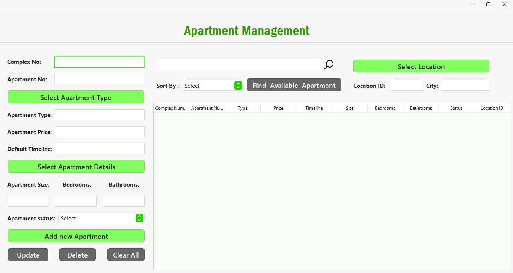
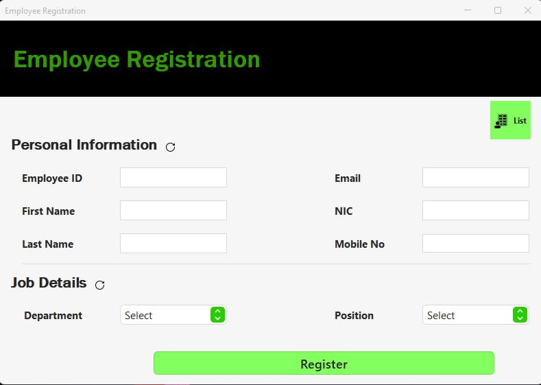
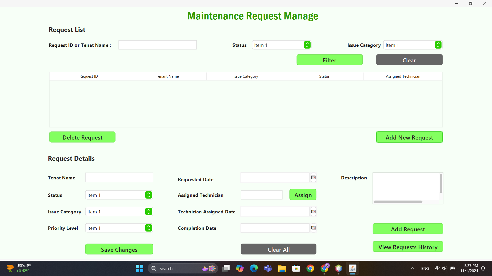
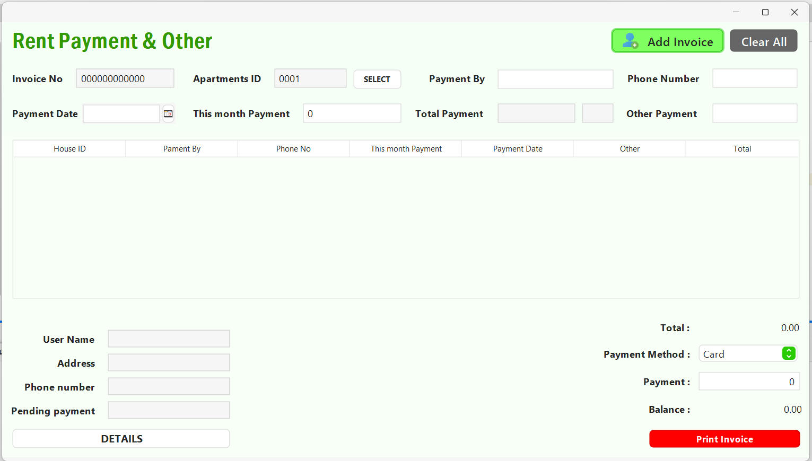
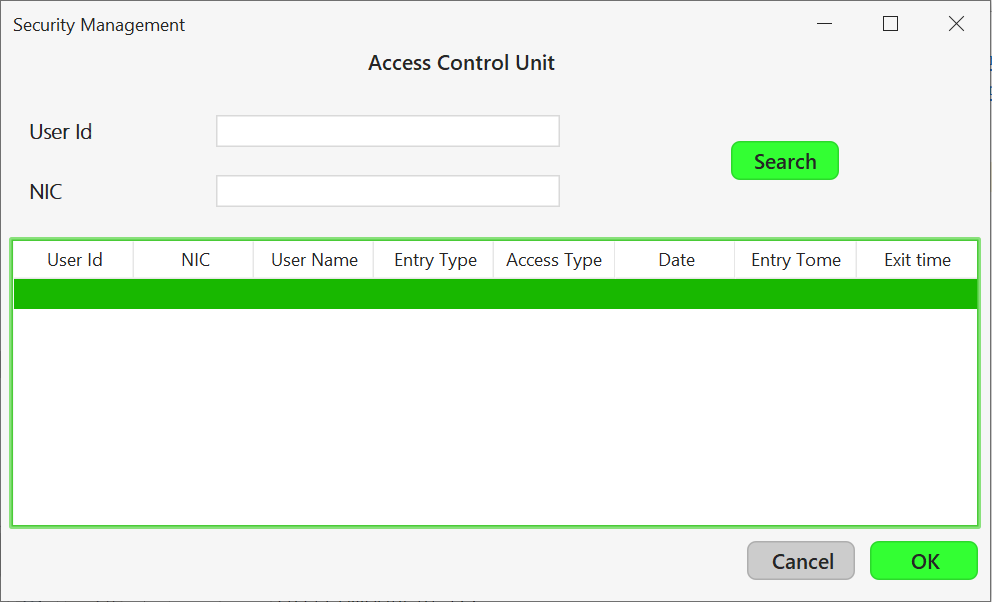
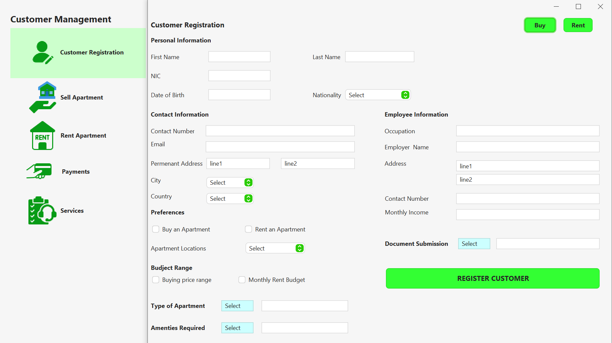

# Residence Management System

A full-stack desktop application developed using Java and MySQL to manage employees, projects, and apartment operations.

## Features
- User authentication (Admin login)
- Employee management
- Project and apartment handling
- Dashboard and reporting

## Technologies
- Java (Swing)
- MySQL

## Author
Rasindu Thenuwara

## Screenshots

### Apartment Management

### Employee Management

### Maintanance Management

### Payment Management

### Security Management

### Tenant Management

